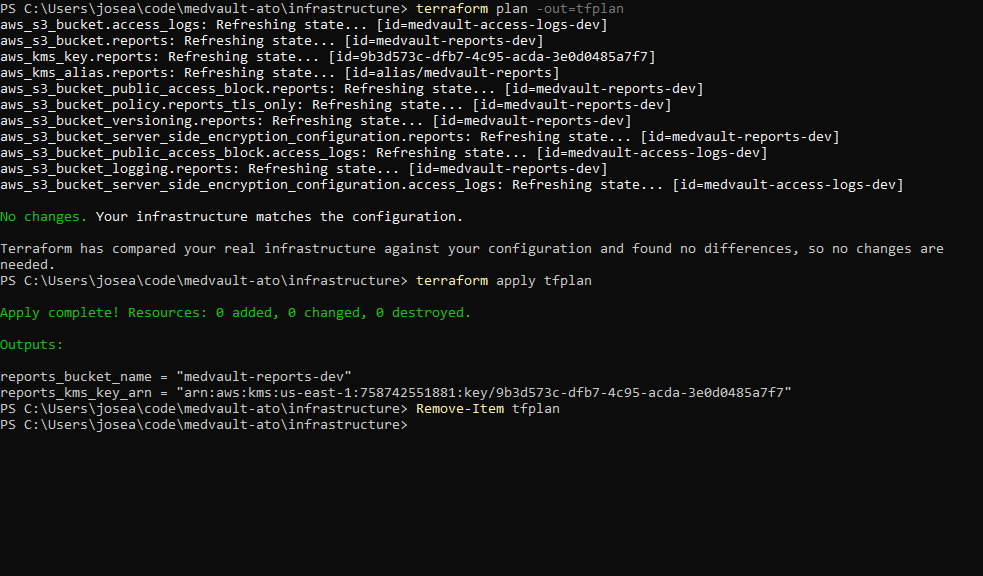
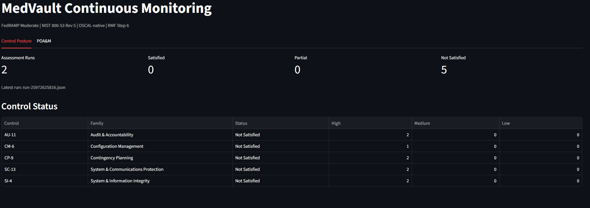
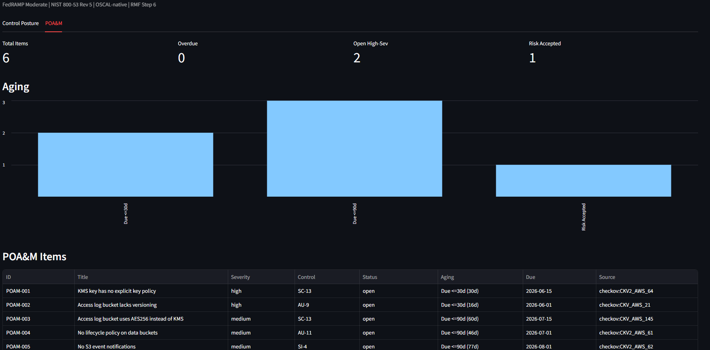
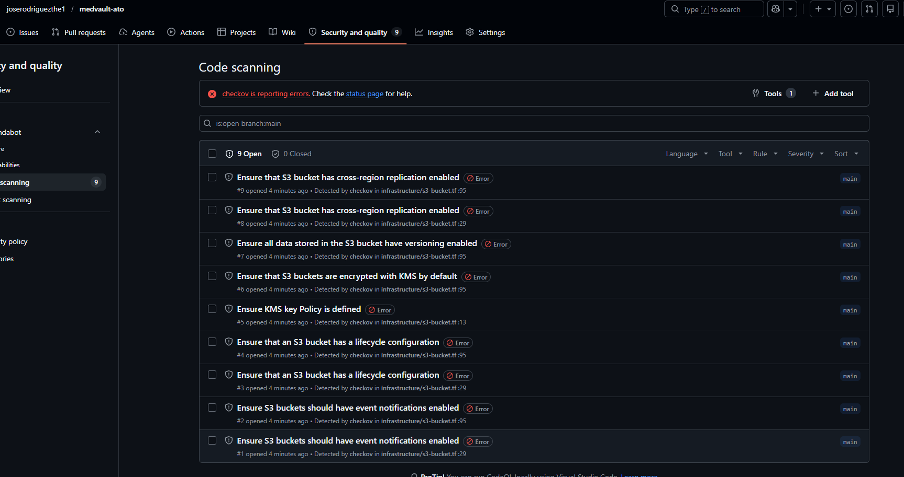
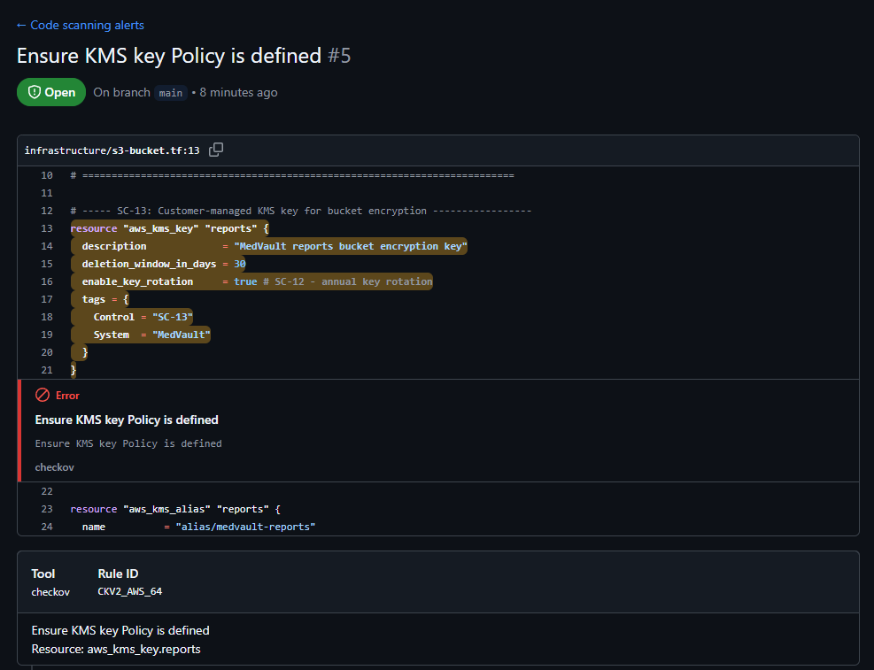
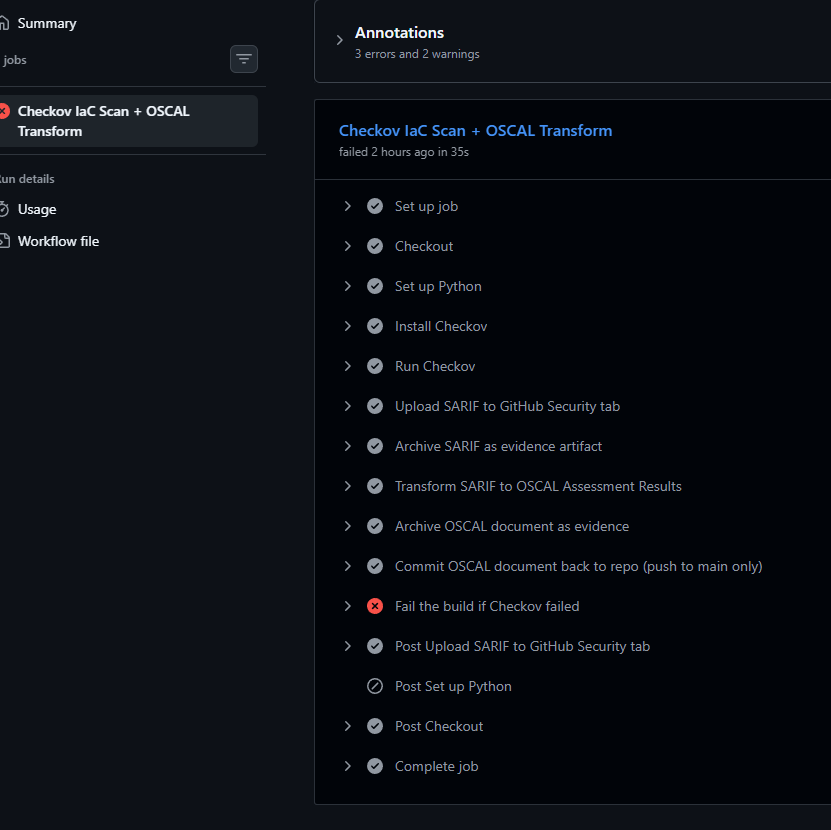
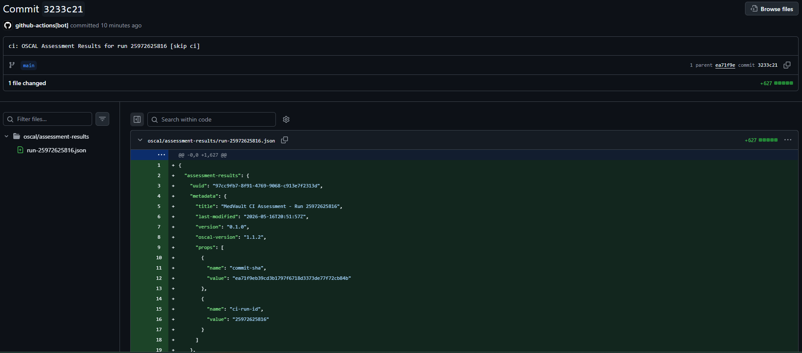
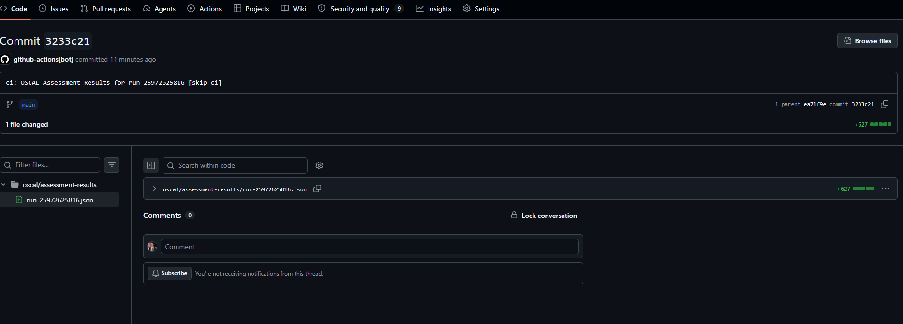
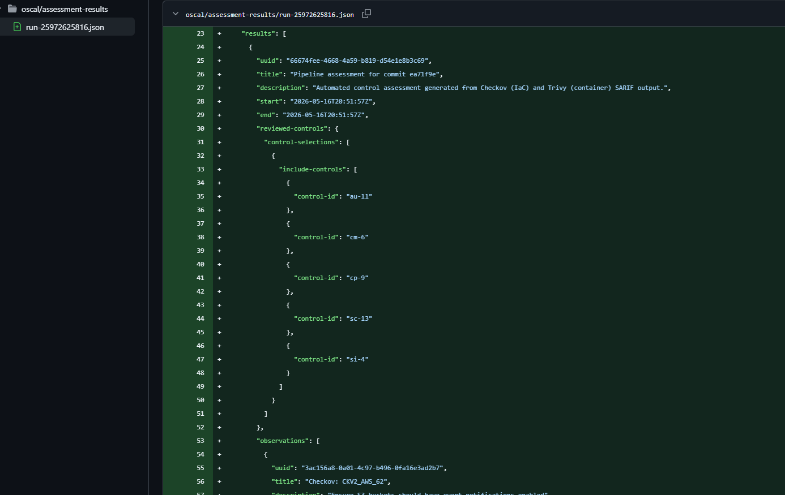

# MedVault - OSCAL-Driven Continuous ATO Pipeline

> A working portfolio project demonstrating end-to-end NIST RMF execution for a cloud-native federal civilian system, with machine-readable compliance artifacts (OSCAL) generated from a live CI/CD pipeline.

  

---

## What this is

MedVault is a **fictional** federal civilian SaaS - a public-health reporting API - used as the system under test for a complete Risk Management Framework (RMF) walkthrough. The repository contains the working artifacts of a continuous Authorization-to-Operate (cATO) pipeline:

- Terraform infrastructure (real AWS resources) with policy-as-code enforcement
- A CI pipeline that emits machine-readable OSCAL Assessment Results on every commit
- A Plan of Action and Milestones (POA&M) tracking accepted findings
- A continuous monitoring dashboard reading directly from OSCAL

All infrastructure is **really deployed** in AWS. All OSCAL documents are **really generated** by the pipeline.

## What it demonstrates

- **OSCAL fluency** - hand-authored POA&M, auto-generated Assessment Results, all valid against NIST 1.1.2 schema
- **Policy-as-code engineering** - every Checkov rule maps to a specific 800-53 control
- **End-to-end RMF execution** - Steps 1 through 6, with artifacts and evidence for each
- **The bot-commits-evidence pattern** - CI generates OSCAL and commits it back to the repo automatically

---

## Screenshots

### Real AWS infrastructure deployed via Terraform

### Continuous monitoring dashboard - Control Posture

### Continuous monitoring dashboard - POA&M

### GitHub Security tab populated by CI

### Drill-down to annotated finding source

### CI pipeline step breakdown

### Bot-committed OSCAL evidence in the repo

### OSCAL document rendered in GitHub

---

## The system

**Categorization:** FIPS 199 Moderate / Moderate / Moderate (overall: **Moderate**)

**Baseline:** NIST 800-53 Rev 5, tailored as **FedRAMP Moderate**

**Cloud:** AWS US-East-1 commercial (real account; ~$1/month)

**Data class:** CUI/HLTH (public-health surveillance reports)

---

## Controls implemented

| Control | Implementation | Evidence |
|---|---|---|
| AC-6 | Least-privilege IAM user for Terraform | docs/iam-policy.json |
| AU-2 | S3 server access logging to separate bucket | infrastructure/s3-bucket.tf |
| CA-7 | Pipeline runs on every push, OSCAL per run | .github/workflows/terraform-scan.yml |
| CM-3 | Branch protection + PR review gate | Workflow gate at end of pipeline |
| CM-6 | Checkov enforces configuration baseline | Checkov SARIF in Security tab |
| RA-5 | Vulnerability scanning of IaC | Checkov runs on every push |
| SA-11 | Developer security testing in CI | Workflow runs SAST on every push |
| SC-13 | KMS customer-managed key + bucket SSE | aws s3api get-bucket-encryption confirms |
| SI-2 | Findings gate the merge | Checkov fails build on violations |

Detailed control matrix: [docs/control-matrix.md](docs/control-matrix.md).

---

## Design choices worth calling out

**Resource-scoped IAM.** The Terraform user has `s3:*` actions scoped to `medvault-*` resources. The user can do anything to MedVault buckets but cannot enumerate other buckets in the account.

**Branch protection is the real gate.** The Checkov step fails the build on violations, but only GitHub branch protection rules actually block merges.

**Cross-region replication is risk-accepted.** FedRAMP Moderate does not require it; S3 standard provides 11-9s within-region durability. Documented as POAM-006 with compensating controls.

**Access log bucket uses AES256.** Intentional to avoid circular KMS dependency. AES256 is FIPS 140-2 validated, so SC-13 is still satisfied. Documented as POAM-003.

---

## Author

Built by **Jose Rodriguez** as a GRC engineering portfolio project.

[GitHub](https://github.com/joserodriguezthe1)

## License

MIT