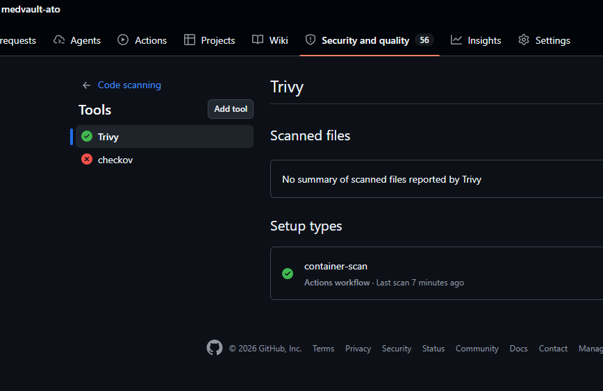
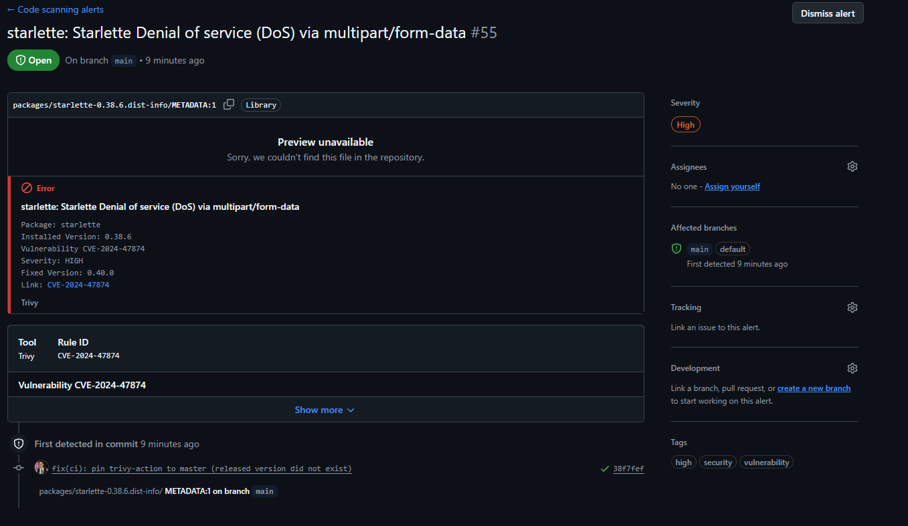
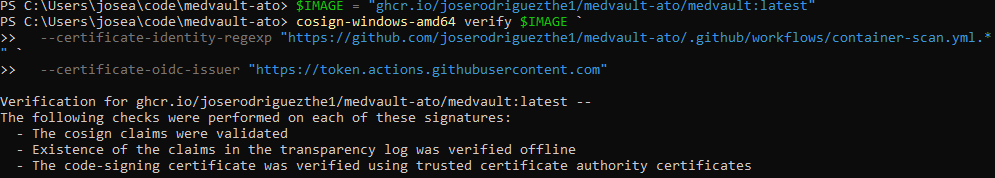
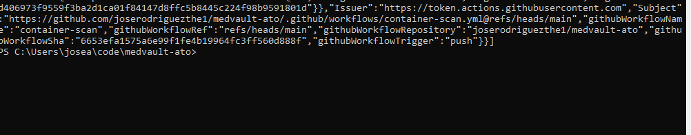
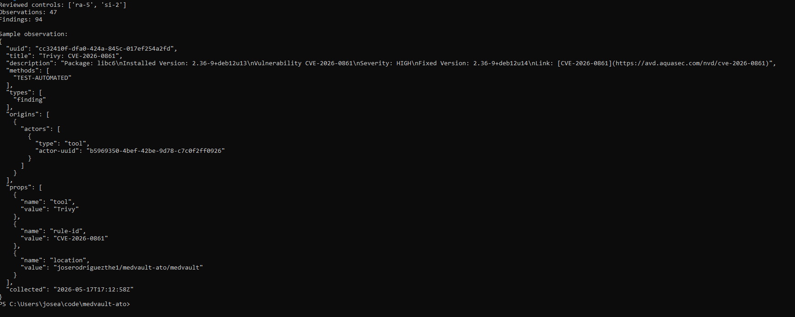
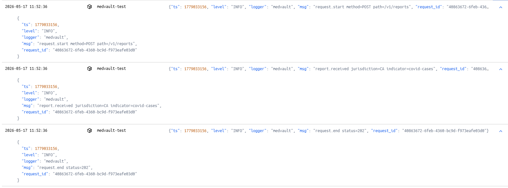

# MedVault - OSCAL-Driven Continuous ATO Pipeline

> A working portfolio project demonstrating end-to-end NIST RMF execution for a cloud-native federal civilian system, with machine-readable compliance artifacts (OSCAL) generated from a live CI/CD pipeline.

  

---

## What this is

MedVault is a **fictional** federal civilian SaaS - a public-health reporting API - used as the system under test for a complete Risk Management Framework (RMF) walkthrough. The repository contains the working artifacts of a continuous Authorization-to-Operate (cATO) pipeline:

- Terraform infrastructure (real AWS resources) with policy-as-code enforcement
- A CI pipeline that emits machine-readable OSCAL Assessment Results on every commit
- A Plan of Action and Milestones (POA&M) tracking accepted findings
- A continuous monitoring dashboard reading directly from OSCAL

All infrastructure is **really deployed** in AWS. All OSCAL documents are **really generated** by the pipeline.

## What it demonstrates

- **OSCAL fluency** - hand-authored POA&M, auto-generated Assessment Results, all valid against NIST 1.1.2 schema
- **Policy-as-code engineering** - every Checkov rule maps to a specific 800-53 control
- **End-to-end RMF execution** - Steps 1 through 6, with artifacts and evidence for each
- **The bot-commits-evidence pattern** - CI generates OSCAL and commits it back to the repo automatically

---

## Screenshots

### Real AWS infrastructure deployed via Terraform


### Continuous monitoring dashboard - Control Posture


### Continuous monitoring dashboard - POA&M


### GitHub Security tab populated by CI


### Drill-down to annotated finding source


### CI pipeline step breakdown


### Bot-committed OSCAL evidence in the repo


### OSCAL document rendered in GitHub


---

## The system

**Categorization:** FIPS 199 Moderate / Moderate / Moderate (overall: **Moderate**)

**Baseline:** NIST 800-53 Rev 5, tailored as **FedRAMP Moderate**

**Cloud:** AWS US-East-1 commercial (real account; ~$1/month)

**Data class:** CUI/HLTH (public-health surveillance reports)

---

## Controls implemented

| Control | Implementation | Evidence |
|---|---|---|
| AC-6 | Least-privilege IAM user for Terraform | docs/iam-policy.json |
| AU-2 | S3 server access logging to separate bucket | infrastructure/s3-bucket.tf |
| CA-7 | Pipeline runs on every push, OSCAL per run | .github/workflows/terraform-scan.yml |
| CM-3 | Branch protection + PR review gate | Workflow gate at end of pipeline |
| CM-6 | Checkov enforces configuration baseline | Checkov SARIF in Security tab |
| RA-5 | Vulnerability scanning of IaC | Checkov runs on every push |
| SA-11 | Developer security testing in CI | Workflow runs SAST on every push |
| SC-13 | KMS customer-managed key + bucket SSE | aws s3api get-bucket-encryption confirms |
| SI-2 | Findings gate the merge | Checkov fails build on violations |

Detailed control matrix: [docs/control-matrix.md](docs/control-matrix.md).

---

## Design choices worth calling out

**Resource-scoped IAM.** The Terraform user has `s3:*` actions scoped to `medvault-*` resources. The user can do anything to MedVault buckets but cannot enumerate other buckets in the account.

**Branch protection is the real gate.** The Checkov step fails the build on violations, but only GitHub branch protection rules actually block merges.

**Cross-region replication is risk-accepted.** FedRAMP Moderate does not require it; S3 standard provides 11-9s within-region durability. Documented as POAM-006 with compensating controls.

**Access log bucket uses AES256.** Intentional to avoid circular KMS dependency. AES256 is FIPS 140-2 validated, so SC-13 is still satisfied. Documented as POAM-003.

---

## Application & Supply Chain Layer

A second pipeline (``container-scan``) covers the application and supply-chain side of the system.

### What it does on every push to ``app/``

1. Builds a hardened distroless container image
2. Pushes to GHCR
3. **Trivy** scans the image (CRITICAL/HIGH/MEDIUM, fixable only)
4. **Syft** generates a CycloneDX SBOM
5. **Cosign** signs the image keylessly via Sigstore (no private keys to manage)
6. **Cosign** attaches the SBOM as a signed predicate
7. SARIF flows to GitHub Security tab and is transformed into OSCAL Assessment Results
8. Bot commits the OSCAL document back to ``main``

### Controls

| Control | Implementation | Evidence |
|---|---|---|
| RA-5 | Trivy container scanning on every push | ``oscal/assessment-results/run-*-container.json`` |
| SI-2 | Trivy gates fixable findings | Workflow run history |
| SI-7 | Cosign keyless signing of every image | Sigstore Rekor transparency log |
| SR-3 | CycloneDX SBOM generated by Syft | Attached attestation on image |
| SR-4 | Provenance via GitHub OIDC + Sigstore | ``cosign verify`` returns workflow identity |
| CM-7 | Distroless image, no shell, no apt | ``app/Dockerfile`` |
| AC-6 | Non-root container user (UID 65532) | ``app/Dockerfile`` |
| AU-3 | Structured JSON audit logs with request_id | ``app/src/main.py`` |

### Cryptographic verification (anyone can do this)

```bash
cosign verify ghcr.io/joserodriguezthe1/medvault-ato/medvault:latest \
  --certificate-identity-regexp "https://github.com/joserodriguezthe1/medvault-ato/.github/workflows/container-scan.yml.*" \
  --certificate-oidc-issuer "https://token.actions.githubusercontent.com"
```

Returns the signature, the Fulcio certificate, and the Rekor transparency log entry - proving the image was built by this exact workflow at a specific commit.

### Screenshots








---

---

## Phase 12 - Full OSCAL Document Family

In addition to the auto-generated Assessment Results and hand-authored POA&M from earlier phases, the ``oscal/`` directory now contains the complete OSCAL document family that a real ATO package requires.

### What's new

| Document | Path | What it says |
|---|---|---|
| **Profile** | [oscal/profiles/medvault-fedramp-moderate.json](oscal/profiles/medvault-fedramp-moderate.json) | Tailored FedRAMP Moderate baseline. Imports the FedRAMP profile and sets 5 organization-defined parameters (lockout thresholds, password length, audit retention, etc.). |
| **Component Definition: Terraform/AWS** | [oscal/component-definitions/terraform-aws.json](oscal/component-definitions/terraform-aws.json) | Implementation claims for 6 controls (AC-6, AU-2, CM-6, SC-13, SC-28, SC-8) covering the AWS infrastructure layer. |
| **Component Definition: GitHub Actions** | [oscal/component-definitions/github-actions-ci.json](oscal/component-definitions/github-actions-ci.json) | Implementation claims for 9 controls (CA-2, CA-7, CM-3, RA-5, SA-11, SI-2, SI-7, SR-3, SR-4) covering the CI/CD pipeline. |
| **Component Definition: FastAPI App** | [oscal/component-definitions/fastapi-app.json](oscal/component-definitions/fastapi-app.json) | Implementation claims for 3 controls (AC-6, AU-3, CM-7) covering the application and container. |
| **System Security Plan** | [oscal/ssp/medvault-ssp.json](oscal/ssp/medvault-ssp.json) | Canonical SSP combining profile, components, system boundary, and 13 control implementations with multi-component aggregation where applicable. |

### The OSCAL graph

All six documents reference each other via stable UUIDs:

Profile (12a)
^
| imports
|
Component Definitions (12b) -----+
|  terraform-aws.json         |
|  github-actions-ci.json     |
|  fastapi-app.json           |
v                             |
SSP (12c) ------------------+    |
|  control claims        |    |
|  by-component refs ----+----+
|  system boundary
v
Assessment Results (per CI run, auto-generated)
|
v
POA&M (hand-authored, links findings to remediation)

A tool consuming this hierarchy can answer queries like *"which component satisfies AC-6?"* (two: Terraform via IAM, FastAPI app via non-root container) or *"what's the implementation status of SC-13?"* (partial - documented gap in POAM-001).

### Honest gaps

Implementation statuses are honest, not aspirational:

- **CM-3 marked partial** - workflow gate exists, but branch protection screenshot evidence pending
- **SC-13 marked partial** - documented in POAM-001 (no explicit KMS key policy)
- **SR-3 marked partial** - base image is tag-pinned, not yet digest-pinned

Real SSPs would cover all 325 FedRAMP Moderate controls; mine covers the 13 actively implemented by this portfolio. The remaining controls would be inherited from AWS or marked planned in a production SSP.

### Why this matters

Most "GRC portfolios" produce Word documents or markdown control matrices. This repository produces **machine-readable, schema-valid OSCAL 1.1.2 documents** that real federal compliance tooling (compliance-trestle, OSCAL CLI, FedRAMP automation pipelines) can ingest directly.

For an interviewer: *"This isn't a description of an OSCAL workflow. It's an OSCAL workflow."*

## Author

Built by **Jose Rodriguez** as a GRC engineering portfolio project.

[GitHub](https://github.com/joserodriguezthe1)

## License

MIT
